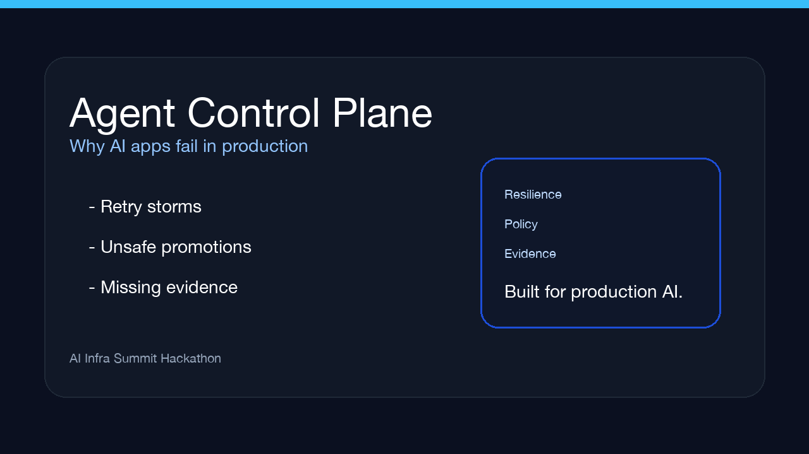

<div align="center">

# 🛡️ Agent Control Plane

**The production-grade runtime for multi-agent AI workflows**  
*Built for the [AI Infra Summit Hackathon](https://lablab.ai/ai-hackathons/ai-infra-summit-hackathon)*

[](https://ai.google.dev)
[](https://cloud.google.com)
[](spec/CHP-v1.0.md)
[](lib/rebac-engine.ts)
[](lib/model-armor.ts)
[](https://nextjs.org)
[](docs/DEMO_VIDEO_SCRIPT.md)
[](LICENSE)

<br/>

[](assets/demo_video.mp4)

**Watch the demo:** [assets/demo_video.mp4](assets/demo_video.mp4)

</div>

---

## 🎬 3-Minute Demo Video & Storyboard

A complete scene-by-scene demo video storyboard with Veo and Gemini generation prompts is documented at [docs/DEMO_VIDEO_SCRIPT.md](docs/DEMO_VIDEO_SCRIPT.md).

```
[0:00 - 0:30] Phase 1: Why agentic apps fail in production
[0:30 - 1:15] Phase 2: Control plane architecture, policy gating, and runtime resilience
[1:15 - 2:05] Phase 3: Live stress test — retry storm, breaker trip, and consensus lock
[2:05 - 2:40] Phase 4: Signed trace ledger and replayable evidence
[2:40 - 3:00] Phase 5: Conclusion & production impact
```

---

## ⚡ The Infra Problem

Production AI systems fail in three predictable ways:

1. **Tool failure snowballs into duplicate work:** retries, timeouts, and flaky downstream services can create storms, double writes, or silent data drift.
2. **Unsafe promotions slip through:** a model, endpoint, or workflow promotion can escape into production without the right policy gate.
3. **Evidence disappears after the fact:** teams cannot reconstruct what happened, who approved it, or how the runtime recovered.

---

## 🏛️ The Solution: Agent Control Plane

**Agent Control Plane** establishes a unified runtime for AI workflows built around three layers:

```
                               ┌────────────────────────────────────────────────────────┐
                                │           Agent Control Plane                           │
                                │         Resilience + Policy + Evidence                 │
                               └──────────────────────────┬─────────────────────────────┘
                                                          │
          ┌───────────────────────┬───────────────────────┼───────────────────────┬───────────────────────┐
          ▼                       ▼                       ▼                       ▼                       ▼
    [Agent Registry]      [Zero-Trust ReBAC]      [Adversarial CHP]       [Runtime Shield]        [Signed Ledger]
    Agent capabilities      SpiceDB / Zanzibar    Proposer vs Challenger   Retry budget + breaker  Signed trace certificates
    Mesh roles              Least-privilege gate   Adjudicator R0 scoring   Idempotency guardrails  Replayable evidence
```

---

## 🚀 The Five Pillars of the Control Plane

### 1. Agent Registry
- Defines workflow, reliability, and ledger agents with explicit capability scopes.
- Keeps the runtime small, typed, and easy to reason about.

### 2. Zero-Trust ReBAC Tool Interceptor
- Implements Google Zanzibar Relationship-Based Access Control (`viewer`, `editor`, `executor`, `council_auditor`).
- Enforces runtime least-privilege: tool calls fail closed unless matching relationship tuples exist.

### 3. Model Armor Guardrail Firewall
- Pre-execution payload inspection screening arguments for indirect prompt injection, role hijacking, directory traversals (`../../`), and secret exfiltration.

### 4. Consensus Hardening Protocol (CHP v1.0)
- High-stakes actions trigger a 3-agent adversarial deliberation:
  - **Round 1 (Proposer):** Formal operational justification and parameter declaration.
  - **Round 2 (Adversarial Challenger Red Team):** Cross-examines the proposal against Memory Bank evidence.
  - **Round 3 (Adjudicator):** Computes consensus confidence ratio $R_0$, verifies threshold floors ($R_0 \ge 0.85$), and generates an immutable cryptographic SHA-256 lock.

### 5. Runtime Shield + Signed Trace Ledger
- Tracks queue depth, retries, breaker state, idempotency keys, and error budget.
- Generates downloadable JSON-LD trace certificates for audits and replay.

---

## 🧪 Interactive Benchmark Scenarios

| Scenario | Vector / Challenge | Gate Triggered | CHP Deliberation Outcome |
|---|---|---|---|
| **Retry Storm on a Flaky Tool Chain** | A timeout loop starts duplicating work unless the runtime enforces idempotency and a breaker. | High retry risk + new integration | Challenger trips the gate $\rightarrow$ **COUNTERSIGN_REQUIRED** |
| **Model Gateway Policy Escalation** | A prompt or config change tries to promote a new model endpoint straight to production. | Deployment promotion + policy risk | Blocked at the policy / armor gate $\rightarrow$ **REJECTED** |
| **Safe Release With Signed Trace** | A routine deployment should pass, commit a signed trace, and preserve replayable evidence. | Low-risk release + verified trace | Challenger confirms the path $\rightarrow$ $R_0 = 0.92$ $\rightarrow$ **LOCKED** |

---

## 🛠️ Quickstart & Local Installation

### Prerequisites
- Node.js 20+

### Setup
```bash
# Clone the repository
git clone https://github.com/icohangar-ops/sovereign-mesh.git
cd sovereign-mesh

# Install dependencies
npm install

# Run the development server
npm run dev
```

Open [http://localhost:3000](http://localhost:3000) to access the Agent Control Plane.

---

## 📦 Project Structure

```
sovereign-mesh/
├── AGENTS.md                          # Enterprise Fleet governance contract & agent manifest
├── package.json                       # Next.js 15 App Router & dependencies
├── assets/
│   └── thumbnail.jpg                  # 16:9 4K Control Plane Thumbnail
├── docs/
│   └── DEMO_VIDEO_SCRIPT.md           # 3-Minute Demo Video Script & Storyboard
├── app/
│   ├── layout.tsx                     # Global typography & root layout
│   ├── page.tsx                       # Master Control Plane Dashboard
│   ├── globals.css                    # Handcrafted design system (Vanilla CSS)
│   └── api/
│       ├── fleet/route.ts             # Agent registry & quota status endpoint
│       ├── rebac/route.ts             # Zanzibar ReBAC policy evaluator
│       ├── runtime/route.ts           # Runtime resilience probe endpoint
│       ├── memory/route.ts            # Evidence bank entity explorer
│       └── deliberate/route.ts        # End-to-end CHP deliberation & decision lock engine
├── components/
│   ├── DeliberationCouncil.tsx        # Live adversarial debate visualizer (Proposer vs Challenger)
│   ├── ZeroTrustGate.tsx              # Real-time Zanzibar ReBAC tool interceptor
│   ├── RuntimeControl.tsx             # Retry / breaker / trace runtime dashboard
│   ├── FleetRegistry.tsx              # Active agent catalog & capability matrix
│   ├── MemoryBankViewer.tsx           # Searchable evidence store
│   └── AuditLedger.tsx                # Signed trace certificates & JSON-LD exporter
└── lib/
    ├── gemini.ts                      # Google GenAI SDK integration with ADC
    ├── rebac-engine.ts                # Zanzibar ReBAC relationship graph logic
    ├── chp-engine.ts                  # Consensus Hardening Protocol v1.0 engine
    ├── model-armor.ts                 # Prompt injection & tool poisoning guardrails
    ├── memory-bank.ts                 # Persistent entity store & baseline state
    ├── scenarios.ts                   # Predefined enterprise benchmark scenarios
    └── types.ts                       # TypeScript interfaces & domain schemas
```

---

## 📜 License

MIT License. Copyright (c) 2026 SovereignMesh Authors.
